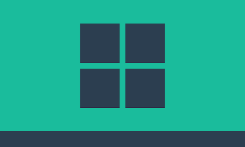
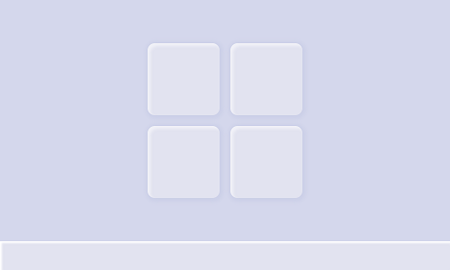
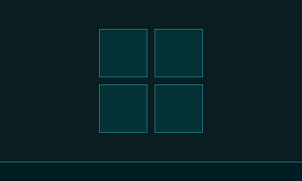
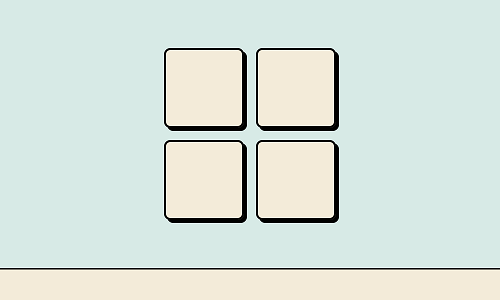

# Winport

My window-styled portfolio

||||
|----|----|----|----|

## Technology stack

* [TypeScript](https://www.typescriptlang.org/)
* [NextJS](https://nextjs.org/)
* [Theme UI](https://theme-ui.com/)
* [Framer Motion](https://www.framer.com/motion/)
* [React Icons](https://react-icons.github.io/react-icons/)

## Improvements from previous version

> For the first version, check out the [v1](https://github.com/khang-nd/.info/tree/v1) branch.

* [x] Overall visual appearance improved.
* [x] Accessibility (focusable elements, keyboard events, zoom controls).
* [x] Smoother and more natural animation with Framer Motion.
* [x] More config options, new theme added.
* [x] Elements in pixels rather than relying on fixed viewport sizes.
* [x] Hide config panel on click outside.

## Credits

* [Gustavo Zambelli](https://dribbble.com/zamax/shots) - for the hilarious [Macindows project](https://dribbble.com/zamax/projects/726224-Macindows-Life-Problems) as the inspiration for my Classic theme.
* [half-left](https://www.deviantart.com/half-left) - for the awesome [Plasma 5 theme](https://www.deviantart.com/half-left/art/Tron-Legacy-For-Plasma-5-568787781) based on the Disney movie Tron Legacy as the inspiration for my Tron theme.
* [Freepik](https://www.freepik.com/) - for providing free and wonderful icons that I used in this project.
