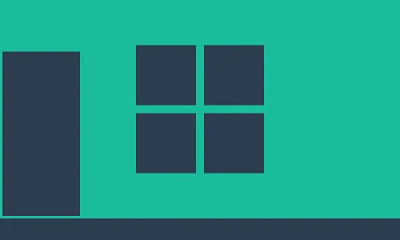

# Winport

A window-styled portfolio (hence the name _Winport_) built with ReactJS, fully responsive, and followed the Mobile First Design's principles.

## Technology Stacks

* [ReactJS](https://reactjs.org/)
* [React Router](https://reactrouter.com/)
* [React Icons](https://react-icons.github.io/react-icons/)
* [React Circular Progressbar](https://github.com/kevinsqi/react-circular-progressbar)
* [Sass](https://sass-lang.com/)
* [local-storage](https://github.com/bevacqua/local-storage)

## Themes

This portfolio is meant to showcase my enthusiasm for front-end and design (none of which are where my background lies, yet I enjoy every moment that I could work on one), therefore, multiple themes are integrated:

* [Flat](https://en.wikipedia.org/wiki/Flat_design)
* Classic
* [Neumorphism](https://medium.com/p/386e6a09040a)

## Special Thanks

* [Gustavo Zambelli](https://dribbble.com/zamax/shots) on Dribbble - for a hilarious [Macindows project](https://dribbble.com/zamax/projects/726224-Macindows-Life-Problems) which I heavily borrowed the idea to create the Classic theme.
* [Freepik](https://www.freepik.com/) - for providing free and wonderful icons that I used in this project.
